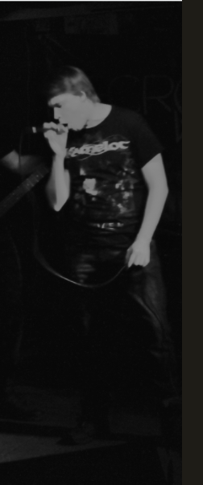

### Pictured left: The author in his natural habitat. &nbsp;

Ville Meriläinen is a Finnish writer of fantasy and horror fiction. His short stories have appeared in various venues online and in print, including the anthologies _Fitting In: Tales of Supernatural Outsiders_, _Writers of the Future vol. 33_, and _Still Waters_, as well as in audio format on _Pseudopod_, _Cast of Wonders_, and _The Centropic Oracle_. Before the coronavirus shut bars down, he performed as the vocalist of a death metal band; now he writes piano pop songs on [Soundcloud](https://soundcloud.com/carcass-eater). He holds a bachelor's degree in English language from the University of Eastern Finland and a deep-rooted loathing for writing of himself in third person from too many short biographies.

## <button type="button" body style="background-color:#252525;">[Back](index.md)</button>
